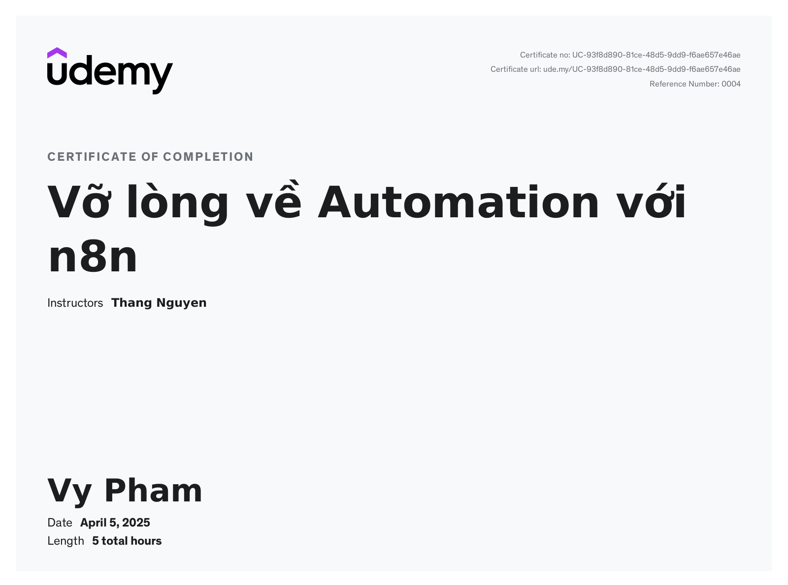

# n8n-Fundamentals
- Set up intelligent workflows with simple drag-and-drop actions.

- Connect applications such as Gmail, Google Sheets, Telegram, Facebook, Airtable, Discord, and more.

- Integrate AI/LLM models like OpenAI, Claude, Gemini, Hugging Face to create chatbots, process text, summarize content, classify information, and more.

  
