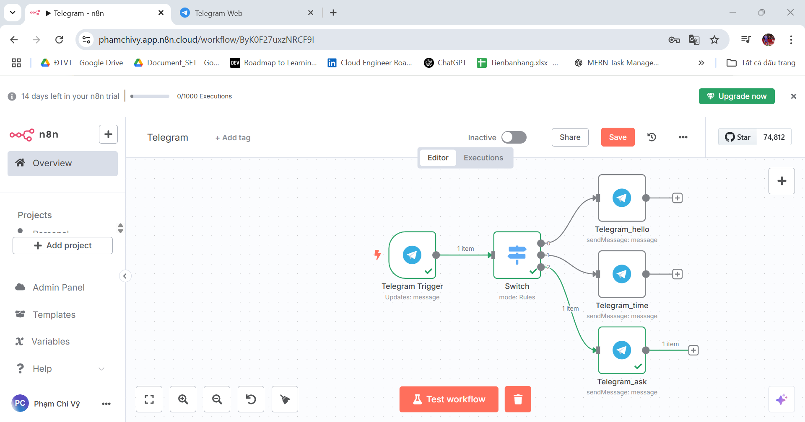
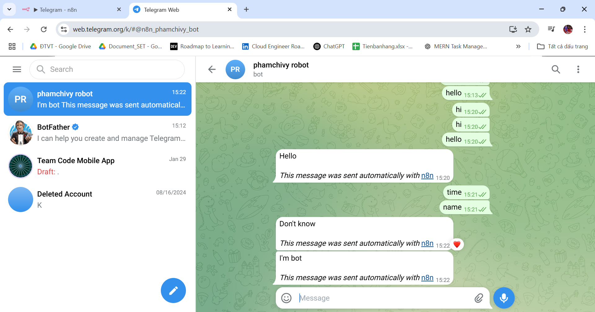

# Simple Telegram Chatbot with n8n

## 1. Create a Telegram Bot
- Use BotFather on Telegram to create a bot and get the API token.

## 2. Configure n8n Workflow
- Add Telegram Node and authenticate using the API token.
- Set up workflow logic to trigger actions based on Telegram commands.
- 
## 3. Test Workflow
- Send a message to your Telegram bot.

